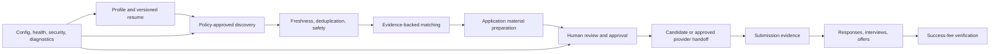

# Task Graph

```mermaid
flowchart LR
  Profile[Profile and versioned resume] --> Discovery[Policy-approved discovery]
  Discovery --> Safety[Freshness, deduplication, safety]
  Safety --> Matching[Evidence-backed matching]
  Matching --> Preparation[Application material preparation]
  Preparation --> Review[Human review and approval]
  Review --> Handoff[Candidate or approved provider handoff]
  Handoff --> Evidence[Submission evidence]
  Evidence --> Tracking[Responses, interviews, offers]
  Tracking --> Fees[Success-fee verification]
  Runtime[Config, health, security, diagnostics] --> Profile
  Runtime --> Discovery
  Runtime --> Review
```

External provider credentials and platform approval gate Handoff. They do not block the internal ledger, preparation, review, or evidence workflow.
